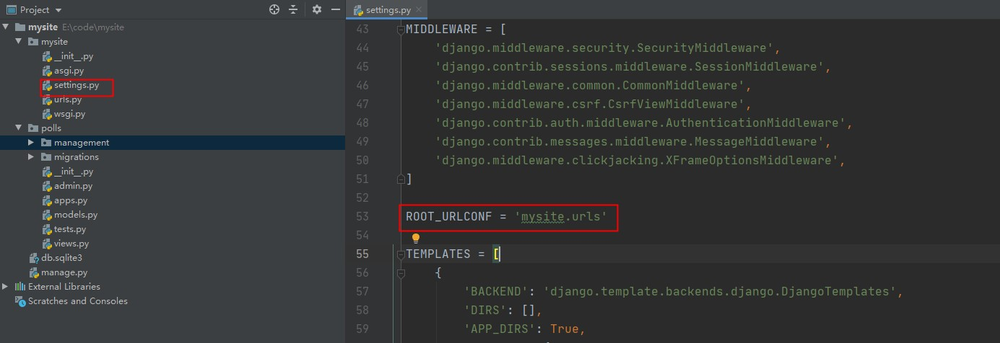

### 1.django如何处理一个请求
1. 确定使用根URLconf模块。在settings.py中有指定ROOT_URLCONF模块路径。

2. django加载该模块，并寻找可用的urlpatterns.urlpatterns一般是django.urls.path()或者django.urls.re_path()的实例。
3. 按照顺序遍历每个url模式，然后在所请求的URL匹配到第一个模式后停止。
4. 如果匹配成功，django导入并调用相关的视图函数。
5. 如果没有URL模式被匹配，django会调用一个适当的错误处理视图。
6. URLConf不检查使用了哪种请求方法，对同一个URL无论是POST，GET，HEAD请求，都对应同一个视图函数。

### 2.一个简单的URLConf
1. 要从URL中取值，使用<>.
2. 捕获的值可以选择性包含转化器类型。比如\<int:name>只捕捉整型参数。
3. /articles/2005/03/会匹配path('articles/\<int:year>/\<int:month>/', views.month_archive)，并对应视图views.month_archive(request, year=2005, month=3) 。
```python
from django.urls import path
from . import views
urlpatterns = [
    path('articles/2003/', views.special_case_2003),
    path('articles/<int:year>/', views.year_archive),
    path('articles/<int:year>/<int:month>/', views.month_archive),
    path('articles/<int:year>/<int:month>/<slug:slug>/', views.article_detail),
]
```

### 3.路径转换器
* str:匹配除了'/'之外的非空字符串。如果表达式内不包含转换器，则会默认匹配字符串。
* int：匹配0或任何正整数。
* slug: 匹配任意有ascii字母或数字以及连字符和下划线组成的短标签。如building-your-1st-django-site。
* uuid:匹配一个格式化的UUID。为了防止多个URL映射到同一个页面，必须包含破折号并且字符都为小写,如075194d3-6885-417e-a8a8-6c931e272f00。
* path:匹配非空字段，包括路径分隔符'/' 。它允许你匹配完整的URL路径而不是像str那样匹配URL的一部分

### 4.使用正则表达式
命名正则表达式组的语法是(?P\<name>pattern)其中name是组名，pattern是要匹配的模式。
```python
from django.urls import path, re_path
from . import views
urlpatterns = [
    path('articles/2003/', views.special_case_2003),
    re_path(r'^articles/(?P<year>[0-9]{4})/$', views.year_archive),
    re_path(r'^articles/(?P<year>[0-9]{4})/(?P<month>[0-9]{2})/$', views.month_archive),
    re_path(r'^articles/(?P<year>[0-9]{4})/(?P<month>[0-9]{2})/(?P<slug>[\w-]+)/$', views.article_detail),
]
```

### 5.包含其他的URLConfs
当django遇到include()时候，会将匹配到该点的URLconf的部分切掉，并将剩余的字符串发送到所包含的URLconf进行进一步处理。
```python
from django.urls import include, path
urlpatterns = [
    path('community/', include('aggregator.urls')),
    path('contact/', include('contact.urls')),
]
```

### 6.url反向解析
* 在模板中使用url模板标签。
* 在python代码中，使用reverse()函数。
* 在与django模型实例的url处理相关代码中使用get_absolute_url()方法。

```python
from django.urls import path
from . import views
urlpatterns = [
    path('articles/<int:year>/', views.year_archive, name='news-year-archive'),
]
```
在模板中：
```python
<a href="">2012 Archive</a>
```
在视图函数中：
```python
from django.http import HttpResponseRedirect
from django.urls import reverse
def redirect_to_year(request):
    year = 2006
    return HttpResponseRedirect(reverse('news-year-archive', args=(year,)))
```
