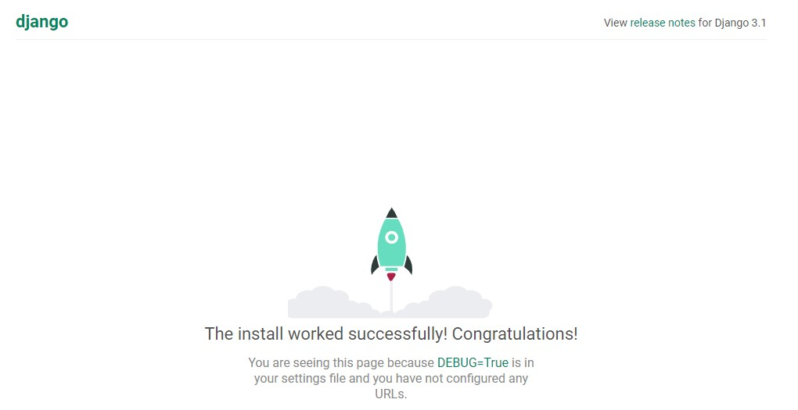

### 1.创建项目
```python
django-admin startproject mysite
```
#### 项目目录结构
```python
mysite/
    manage.py
    mysite/
        __init__.py
        settings.py
        urls.py
        asgi.py
        wsgi.py
```
* 最外层的mysite/:根目录名称，根目录名称对Django没有影响，你可以将它重命名为任何名称。
* manage.py:Django项目的命令行管理工具。
* 内层mysite/:纯python包，包含你的项目。
* mysite/settings.py：Django项目的配置文件。
* mysite/urls.py：Django 项目的URL声明，就像你网站的“目录”。
* mysite/asgi.py：项目运行在ASGI兼容的Web服务器上的入口。
* mysite/wsgi.py：项目运行在WSGI兼容的Web服务器上的入口。

### 2.启动用于开发的简易服务器
```python
python manage.py runserver
```
运行结果
```python
E:\code\mysite>python manage.py runserver
Watching for file changes with StatReloader
Performing system checks...

System check identified no issues (0 silenced).

You have 18 unapplied migration(s). Your project may not work properly until you apply the migrations for app(s): admin, auth, contenttypes, sessions.
Run 'python manage.py migrate' to apply them.
October 20, 2020 - 11:38:06
Django version 3.1.2, using settings 'mysite.settings'
Starting development server at http://127.0.0.1:8000/
```
访问地址：http://127.0.0.1:8000/


### 3.创建投票应用
```python
python manage.py startapp polls
```
根目录下会生成一个polls目录：
```python
polls/
    __init__.py
    admin.py
    apps.py
    migrations/
        __init__.py
    models.py
    tests.py
    views.py
```
### 4.设置时区和语言
/mysite/mysite/settings.py
```python
LANGUAGE_CODE = 'zh-hans'
TIME_ZONE = 'Asia/Shanghai'
```
settings.py文件中INSTALLED_APPS包含的django自带应用。
* django.contrib.admin：管理员站点。
* django.contrib.auth：认证授权系统。
* django.contrib.contenttypes：内容类型框架。
* django.contrib.sessions：会话框架。
* django.contrib.messages：消息框架。
* django.contrib.staticfiles：管理静态文件的框架。
### 5.创建模型-polls/models.py
**模型是真实数据的简单明确的描述，它包含了存储的数据所必须的字段和行为。**</br>
每个模型都是django.db.models.Model的子类，模型中的类变量表示数据库中的字段。

```python
from django.db import models
from django.utils import timezone
import datetime

class Question(models.Model):
    question_text = models.CharField(max_length=200)
    pub_date = models.DateTimeField()

    def __str__(self):
        return self.question_text

class Choice(models.Model):
    question = models.ForeignKey(Question, on_delete=models.CASCADE)
    choice_text = models.CharField(max_length=200)
    votes = models.IntegerField(default=0)

    def __str__(self):
        return self.choice_text
```
### 6.激活模型(Models)
#### 首先需要把polls应用配置到项目的INSTALLED_APPS中。
```python
INSTALLED_APPS = [
    'polls.apps.PollsConfig',
    ...
    ...
]
```
#### 迁移数据库
1. 生成迁移文件
2. 应用到数据库
```python
# 为模型的改变生成迁移文件（sql语句）
python manage.py makemigrations polls
# 选中所有还没有执行过的迁移，并应用在数据库上面，也就是将模型的更改同步到数据库上
python manage.py migrate
```
### 7.创建视图(Views)
