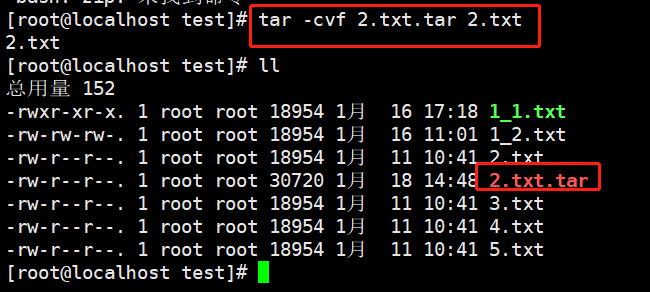

## 常用系统工作命令
常用系统工作命令(echo,date,reboot,poweroff,wget,ps,top,pidof,kill,killall,whereis,locate,tar,sync)。

#### 1.echo命令(用于在终端输出字符串或变量提取后的值)

```
[root@iZ8vb6ughzbdqkfd58dowoZ ~]# echo hello
hello
[root@iZ8vb6ughzbdqkfd58dowoZ ~]# echo $SHELL
/bin/bash
```
#### 2.date命令(用于显示及设置系统的时间或日期)
**查看系统时间**

```
[root@iZ8vb6ughzbdqkfd58dowoZ ~]# date
Sun Feb 16 19:44:04 CST 2020
```
**指定格式查看系统时间**

```
[root@iZ8vb6ughzbdqkfd58dowoZ ~]# date "+%Y-%m-%d %H:%M:%S"
2020-02-16 19:45:25
```
**设置系统时间**

```
date -s "20170901 8:30:00"
```
#### 3.reboot命令
**用于重启系统，默认只能使用root管理员来重启。**
#### 4.poweroff命令
**用于关闭系统，默认只能使用root管理员才能关闭电脑。**
#### 5.wget命令(用于在终端中下载网络文件)

参数| 作用
---|---
-b | 后台下载模式
-P | 下载到指定目录
-t | 最大尝试次数
-c | 断点续传
-p | 下载页面内所有资源，包括图片视频
-r | 递归下载

#### 6.ps命令(用于查看系统中的进程状态)

```
[root@iZ8vb6ughzbdqkfd58dowoZ ~]# ps -au
USER       PID %CPU %MEM    VSZ   RSS TTY      STAT START   TIME COMMAND
root       555  0.0  0.0 110104   828 ttyS0    Ss+   2019   0:00 /sbin/agetty --keep-baud 115200,38400,9600 ttyS0 vt220
root       556  0.0  0.0 110104   808 tty1     Ss+   2019   0:00 /sbin/agetty --noclear tty1 linux
root     22260  0.0  0.2 115440  2112 pts/0    Ss   19:23   0:00 -bash
root     22279  0.0  0.1 115440  2012 pts/1    Ss+  19:23   0:00 -bash
root     22385  0.0  0.1 155360  1880 pts/0    R+   20:15   0:00 ps -au
```

标题 | 含义
---|---
USER | 进程的所有者
PID | 进程ID
%CPU | 运算器占用率
%MEM | 内存占用率
VSZ | 虚拟内存使用量(Kb)
RSS | 占用的固定内存量(Kb)
TTY | 所在终端
STAT | 进程状态
START | 被启动的时间
TIME | 实际使用CPU的时间
COMMAND | 命令名称与参数

**进程状态**
- R：运行，进程正在运行或在运行队列中等待。
- S：中断，进程处于休眠中，当某个条件形成后或者接收到信号时，脱离该状态。
- D：不可中断，进程不响应系统异步信号，即使用kill命令也不能将其中断。
- Z：僵死，进程已经终止，但进程描述符依然存在，直到父进程调用系统函数后将进程释放。
- T：停止，进程收到信号后停止运行。

#### 7.top命令
**用于动态监视进程活动与系统负载等信息。top命令前五行为系统的整体统计信息：**
1. 第一行，系统时间、运行时间、登录终端数、系统负载（三个数值分别为1分钟，5分钟，15分钟内的平均值）
2. 进程总数、运行中的进程数、停止的进程数、僵死的进程数。
3. 用户占用资源百分比、系统内核占用资源百分比、改变过优先级的进程资源百分比、空闲的资源百分比。
4. 物理内存总量、内存使用量、内存空闲量、作为内核缓存的内存量。
5. 虚拟内存总量、虚拟内存使用量、虚拟内存空闲量、已被提前加载的内存量。

#### 8.pidof命令
**查看某个指定服务进程的PID值。每个进程的PID是唯一的，可以通过PID来区分不同的进程。**

```
[root@iZ8vb6ughzbdqkfd58dowoZ ~]# pidof sshd
22277 22258 1027
```
#### 9.kill命令
**用于终止指定PID的进程服务。**
#### 10.killall命令
**用于终止指定名称的服务所对应的全部进程。**

#### 11.whereis(搜索命令)
**whereis 命令不能搜索普通文件，而只能搜索系统命令**
#### 12.locate(按照文件名搜索普通文件)
**centOS7以上的系统中使用“locate”文件查找命令,需要先安装locate命令**
* yum install mlocate
* updatedb
* locate inittab


#### 13.tar(打包与解打包)
**打包： tar -cvf 压缩包名 源文件**
* -c：打包
* -v：显示打包文件过程
* -f：指定压缩包的文件名

**解打包(.tar)：tar xvf 压缩包**
* -x：解打包
* -v：显示打包文件过程
* -f：指定压缩包的文件名

**解打包(.gz)：tar zxvf 压缩包**



#### 14.sync(刷新文件系统缓冲区)
计算机上保存数据其实是先在内存中保存一定时间，再写入硬盘。这其实是一种缓存机制，当在内存中保存的数据需要被读取的时候，从内存中读取要比从硬盘中读取快得多。

不过，如果数据还没有来得及保存到硬盘中，就发生了突然岩机（比如断电）的情况，数据就会丟失。

sync 命令的作用就是把内存中的数据强制向硬盘中保存。这个命令在常规关机的命令中其实会自动执行，但如果不放心，则应该在关机或重启之前手工执行几次，避免数据丟失。
