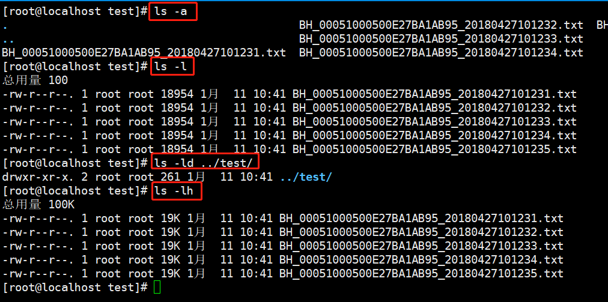

## Linux目录切换与文本编辑
(pwd,cd,ls,cat,more,head,tail,tr,wc,stat,cut,diff)

#### 1.pwd命令(显示当前用户所处的工作目录)

```
[root@iZ8vb6ughzbdqkfd58dowoZ ~]# pwd
/root
```
#### 2.cd命令(切换工作路径)

* cd /usr/local : 切换到指定文件夹
* cd ~ : 切换到用户的家目录(root)
* cd - : 切换到上一次所在的目录
* cd ../: 切换到上级目录

#### 3.ls命令(显示目录中的文件信息)
* -a：显示所有文件
* -l：显示目录下文件的详细信息（权限、所有者、大小、时间等）
* -d：显示目录信息，而不是目录下的文件
* -h：人性化显示，按照我们习惯的单位显示文件大小

#### 命令
* ls -a : 显示所有文件(包含隐藏文件)
* ls -l : 显示目录下文件的详细信息
* ls -ld : 显示某个文件夹的详细信息
* ls -lh : 人性化的方式显示文件详细信息




#### 4.cat命令(用于查看内容较少的纯文本文件)
```
[root@iZ8vb6ughzbdqkfd58dowoZ ~]# cat -n test.py
     1	import socket  
     2	if __name__ == '__main__':
     3	    print('发送。。。')
     4	    s= socket.socket()  
     5	    s.connect(('113.57.168.74', 10301))  
     6	    send_data = b'FFFF#\x00\x04#0412'
     7	    s.sendall(send_data)  
     8	    s.close()  

```
#### 5.more命令(用于查看内容较多的纯文本文件)

#### 6.head命令(用于查看纯文本文档的前N行)

```
[root@iZ8vb6ughzbdqkfd58dowoZ ~]# head -n 6 test.py
import socket  
if __name__ == '__main__':
    print('发送。。。')
    s= socket.socket()  
    s.connect(('113.57.168.74', 10301))  
    send_data = b'FFFF#\x00\x04#0412'
```
#### 7.tail命令
**用于查看纯文本文档的后N行，或持续刷新内容。**
#### 8.tr命令
**用于替换文本文件中的字符。tr [原始字符] [目标字符]**

```
[root@iZ8vb6ughzbdqkfd58dowoZ ~]# cat test.txt | tr [a-z] [A-Z]
THE ZEN OF PYTHON, BY TIM PETERS

BEAUTIFUL IS BETTER THAN UGLY.
EXPLICIT IS BETTER THAN IMPLICIT.
SIMPLE IS BETTER THAN COMPLEX.
COMPLEX IS BETTER THAN COMPLICATED.
FLAT IS BETTER THAN NESTED.
SPARSE IS BETTER THAN DENSE.
READABILITY COUNTS.
SPECIAL CASES AREN'T SPECIAL ENOUGH TO BREAK THE RULES.
ALTHOUGH PRACTICALITY BEATS PURITY.
ERRORS SHOULD NEVER PASS SILENTLY.
UNLESS EXPLICITLY SILENCED.
IN THE FACE OF AMBIGUITY, REFUSE THE TEMPTATION TO GUESS.
THERE SHOULD BE ONE-- AND PREFERABLY ONLY ONE --OBVIOUS WAY TO DO IT.
ALTHOUGH THAT WAY MAY NOT BE OBVIOUS AT FIRST UNLESS YOU'RE DUTCH.
NOW IS BETTER THAN NEVER.
ALTHOUGH NEVER IS OFTEN BETTER THAN *RIGHT* NOW.
IF THE IMPLEMENTATION IS HARD TO EXPLAIN, IT'S A BAD IDEA.
IF THE IMPLEMENTATION IS EASY TO EXPLAIN, IT MAY BE A GOOD IDEA.
NAMESPACES ARE ONE HONKING GREAT IDEA -- LET'S DO MORE OF THOSE!
```
#### 9.wc命令
**用于统计指定文本的行数，字数，字节数。wc [参数] 文本**

参数 | 作用
---|---
-l | 只显示行数
-w | 只显示单词数
-c | 只显示字节数

```
[root@iZ8vb6ughzbdqkfd58dowoZ ~]# wc -l test.txt
21 test.txt
[root@iZ8vb6ughzbdqkfd58dowoZ ~]# wc -w test.txt
144 test.txt
[root@iZ8vb6ughzbdqkfd58dowoZ ~]# wc -c test.txt
857 test.txt
```
#### 10.stat命令
**用于查看文件的存储信息和时间等信息。**

```
[root@iZ8vb6ughzbdqkfd58dowoZ ~]# stat test.txt
  File: ‘test.txt’
  Size: 857       	Blocks: 8          IO Block: 4096   regular file
Device: fd01h/64769d	Inode: 917525      Links: 1
Access: (0644/-rw-r--r--)  Uid: (    0/    root)   Gid: (    0/    root)
Access: 2020-02-17 20:02:23.563420881 +0800
Modify: 2020-02-17 20:02:21.621455433 +0800
Change: 2020-02-17 20:02:21.621455433 +0800
 Birth: -
```
#### 11.cut命令
**用于按列提取文本字符。**
#### 12.diff命令
**用于比较多个文本的差异。diff -c file1 file2**
